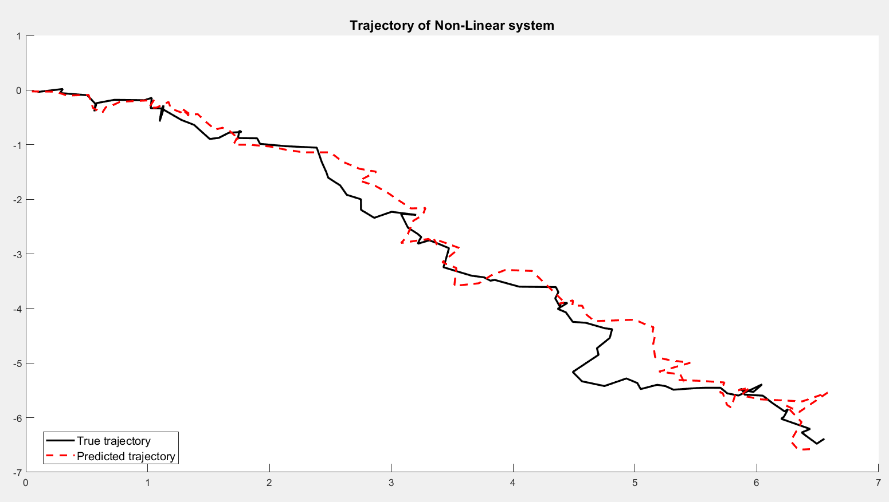

# The Extended Kalman Filter
The repository impliments Extended Kalman filter algorithm for a non-linear system given observations from a radar. The description for the system, EKF algorithm and simulation steps can be found in the [report](Report/report.pdf) 

## Working and results
The Filter tracks a non-linear object given the range and angle of the object obtained from the Radar. The results of the filter are given in the figure below: 

## Contribution 
In order to contribute to this project, you can go through the [report](Report/report.pdf)/[report.tex](Report/report.tex) and suggest changes to the respective functions by creating a pull request. 

